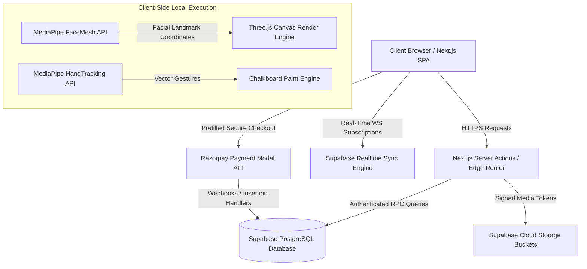

# Student LMS

A premium, production-grade, highly interactive Learning Management System (LMS) built for modern universities and educational institutions. Leveraging a robust serverless architecture, real-time sync networks, digital signature verification, and machine learning components, Student LMS provides an unparalleled workspace for student communities, faculty instruction, and administrative management.

---

## 🏛️ System Architecture & Workflow

The architecture is built on a 1-to-1 decoupling of a client-side server-rendered **Next.js SPA** and a secure, transaction-safe **Supabase Cloud Backend**.



### Key Workflow Loops

1. **Course Unlock & Payment Registry:**
   * **Subject Lock:** Unpurchased courses display a secure ink-sketch lock overlay.
   * **Initiation:** Triggering unlock opens the pre-filled, transaction-safe Razorpay Checkout.
   * **Success:** Inserts a verified `status: completed` transaction row in PostgreSQL, auto-unlocks resources, and pushes a client refresh.
   * **Failure:** Triggers a programmatic `rzp.close()` immediately dismissing the lingering iframe modal, redirects to `/dashboard` with query parameters, displays a non-blocking toast warning, and clears history variables immediately to prevent recurrence.

2. **Digital Certificate Verification:**
   * **Prerequisites:** Complete all course lectures. Once complete, if the **Admin** has set the certificate to *Available* (controlled via an admin-exclusive subject control panel), the student sees the "Get the certificate" CTA.
   * **Holographic Rendering:** The modal pre-fetches a base64 string of the Admin's authentic digital signature.
   * **Landscape Vector Vectorization:** Triggering print injects the active Next.js stylesheets (Tailwind + cached Google Fonts) and maps the certificate layout exactly onto a physical `297mm x 210mm` (A4 landscape) print boundary, rendering identical outputs under default browser margins without overflow truncation.

3. **Whiteboard Discussion Boards:**
   * **Real-time Broadcast:** Messages sent inside subjects are instantly broadcast via postgres-changes triggers.
   * **Presence Tracking:** Tracks active users typing via presence syncing state channels.

---

## 🛠️ Feature Set

* **🎓 Subject & Content Management:** Structured multi-unit course modules with organized files, documents, and bookmarked video lessons.
* **🔖 Video Bookmarking:** Students can bookmark specific timestamps within video lessons to quickly reference important material later.
* **🔔 Notifications & Progress Tracking:** Automated alerts instantly notify students when new videos or materials are posted. Teachers utilize dedicated tracking tools to monitor individual student progress and engagement.
* **🛡️ Granular Role Access Control:** 
  * *Admin:* User directory administration, system-wide analytics, faculty application processing, and manual certificate release management.
  * *Faculty:* Create courses, compile subjects, upload curriculum resources, and monitor classroom progress.
  * *Student:* Watch courses, participate in peer group whiteboard chats, download verified credentials, and trace progress.
* **🎮 Fun Zone (Gesture & AI Engine):**
  * *Mood Analyzer:* Real-time user mood assessment using MediaPipe FaceMesh to check study fatigue.
  * *Hand Drawing:* Hand-tracking paint canvas for interactive drawing.
  * *Hand Gesture Sphere:* 3D particle sphere responding to hand rotation matrices in real-time.

---

## ⚙️ Tech Stack

* **Core Framework:** Next.js 16.1 & React 19.2 (using Turbopack Edge Compiler)
* **Typed Safety:** TypeScript 5
* **Styling & Layout:** TailwindCSS 4, Radix UI Primitive Foundations
* **Authentication & Backend:** Supabase (Auth, Storage Bucket networks, Realtime Websocket Channels)
* **Payment Gateway:** Razorpay API Core Integration
* **Visuals & AI Engine:** Three.js, MediaPipe FaceMesh, MediaPipe HandTracking

---

## 🚀 Installation & Quick Start

### 1. Prerequisites
* **Node.js:** v18.x or v20.x
* **Database:** Active Supabase cloud database instance

### 2. Quick Install
```bash
# Clone the repository
git clone https://github.com/Shyamyemuka/StudentLMS.git
cd StudentLMS

# Install dependency tree
npm install

# Switch to frontend sub-module
cd frontend
npm install
```

### 3. Environment Configurations
Create a `.env.local` file inside the `frontend/` directory:
```env
NEXT_PUBLIC_SUPABASE_URL=https://your-supabase-project.supabase.co
NEXT_PUBLIC_SUPABASE_ANON_KEY=your-supabase-anonymous-api-key
NEXT_PUBLIC_RAZORPAY_KEY_ID=your-razorpay-checkout-key-id
```

### 4. Running the Application
```bash
# Run local compilation & Hot Module Reload server
npm run dev
```
Open [http://localhost:3000](http://localhost:3000) in your browser.

---

## 📂 Project Directory Structure

```
StudentLMS/
├── frontend/
│   ├── app/           # Next.js App Router (Layouts, server actions, route handlers)
│   ├── components/    # Reusable React UI (Subjects, chat boards, notification bells)
│   ├── lib/           # Supabase client declarations, middleware hooks, auth checks
│   ├── types/         # Strongly-typed database interfaces
│   └── public/        # Asset bundles (images, vector logs, signatures)
├── backend/           # Serverless SQL migrations & RLS setups
└── README.md          # Project documentation
```

---

## 👨‍💻 Author
**Shyam Yemuka**  

