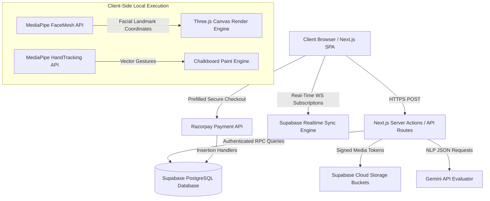
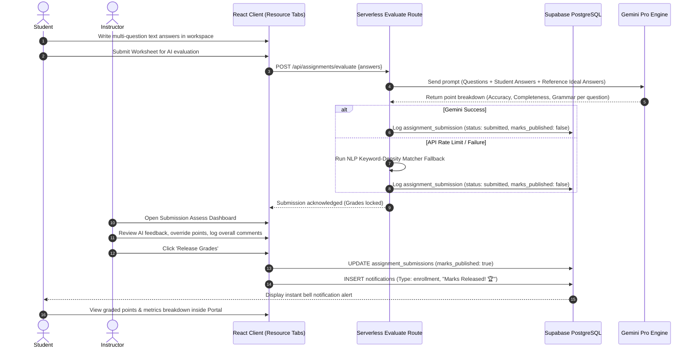
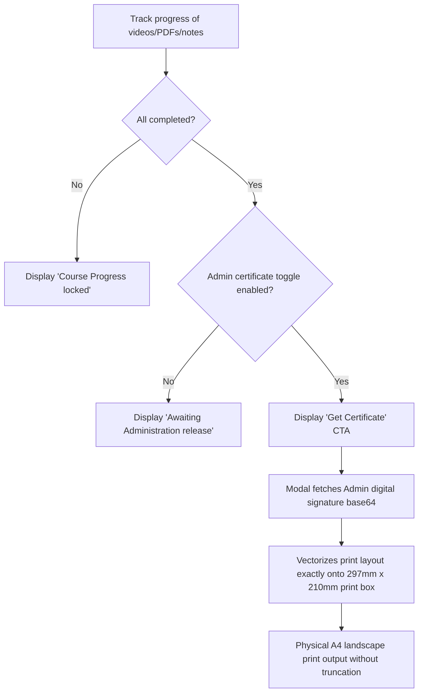

# 🎓 Student LMS

A premium, production-grade, highly interactive Learning Management System (LMS) designed for modern universities and educational institutions. Leveraging a robust serverless architecture, real-time sync networks, digital signature verification, and machine learning components, Student LMS provides an unparalleled workspace for student communities, faculty instruction, and administrative management.

---

## 🗺️ Visual Architecture Minimap

The following maps illustrate the decoupling of our client-side Next.js SPA from our transaction-safe Supabase cloud database, our AI evaluator pipeline, and the landscape certificate printing boundaries.

### 1. Global System Workflow & Sync Engine
This diagram illustrates the secure data flow, payment processing, real-time websocket sync, and edge API executions.



### 2. Multi-Question AI Evaluation Pipeline
This sequence details how a student submits answer sheets, the instant AI grading evaluation occurs via API, and the instructor releases grades.



### 3. Digital Certificate Vectorization & Print Overlay
How physical verification occurs based on course lecture completion and signature templates.



---

## ⚡ Core Architecture Workflows

### 💳 1. Razorpay Secure Checkout & Failure Resilience
* **Subject Lock Overlay:** Unpurchased courses display a secure ink-sketch lock overlay rendering price tag badges.
* **Prefilled Modal Checkout:** Clicking "Unlock Course" initiates the transaction-safe Razorpay Checkout prefilled with student profile credentials.
* **Success Loop:** Triggers an insert of a verified `status: completed` transaction row, unlocks all course tabs, and pushes a client-side route refresh to unblur page elements.
* **Fail-Safe Recovery Loop:** If a transaction fails or the modal is dismissed, a programmatic `rzp.close()` immediately closes the modal, redirects to the student dashboard with query parameters, displays a neobrutalist red `Payment Unsuccessful` warning banner, and sounds a Sonner alert while purging old state variables.

### ✍️ 2. Dynamic Multiple-Question Worksheets
* **Dynamic Form Creator:** Allows Faculty to post sheets with an arbitrary list of questions, prompts, ideal reference answers, and max points per question in a single dynamic card stack.
* **Tab-Integrated Workspace:** Worksheets are nested directly as the fourth tab inside the course view. Students compose answers, navigate through indices, and submit answers.
* **Instructor Override Panel:** Submissions are reviewed side-by-side with AI metrics. Faculty can override final scores, write custom feedback remarks, and publish student grades instantly.

### 💬 3. Whiteboard Syncing & Presence Tracking
* **Realtime Chat Sync:** Classroom group discussion boards are enabled with PostgreSQL database replicas, broadcasting messages in sub-milliseconds.
* **Presence Synchronizer:** Synced state channels show exactly who is actively online in the classroom chat.

### 📊 4. Attention Heatmaps & Timestamp Bookmarking
* **Timestamps Bookmarking:** Students can bookmark specific timestamps in lectures to review later.
* **Attention Tracking Logs:** Collects attention intervals during lecture watching and graphs them in a high-fidelity analytics dashboard for classroom progress reviews.

---

## 📋 Features Checklist Matrix

### 1. Role-Based Access Control (RBAC) Matrix

| Feature | Student | Faculty | Admin | Guest |
| :--- | :---: | :---: | :---: | :---: |
| **Marketplace Browsing** | ✔ | ✔ | ✔ | ✔ |
| **Discussion Boards & Chat** | ✔ | ✔ | ✔ | ❌ |
| **Watch Videos & PDFs** | ✔ (If Unlocked) | ✔ | ✔ | ❌ |
| **Bookmark Timestamps** | ✔ | ❌ | ❌ | ❌ |
| **Write Worksheet Answers** | ✔ | ❌ | ❌ | ❌ |
| **Create Course & Syllabus** | ❌ | ✔ | ✔ | ❌ |
| **Post Assignment Sheets** | ❌ | ✔ | ✔ | ❌ |
| **AI Assessment & Override**| ❌ | ✔ | ✔ | ❌ |
| **Release Grades & Mark Progress**| ❌ | ✔ | ✔ | ❌ |
| **Process Faculty Signups** | ❌ | ❌ | ✔ | ❌ |
| **View System-wide Analytics**| ❌ | ❌ | ✔ | ❌ |

---

### 2. Functional Checklist

#### 🎓 Subject Workspace
- [x] Organized tabs layout separating **Videos**, **PDFs**, **Notes**, and **Assignments** in a single subject view.
- [x] Progress tracking checkboxes ("Mark as Completed") updates student completion logs.
- [x] Discussion board with real-time websocket broadcast and active user presence tracking.
- [x] Holographic certificate printing panel for course completions.

#### ✍️ Worksheets Workspace
- [x] Dynamic Multi-Question assignment publisher form.
- [x] Point-by-point reference ideal answer inputs for AI evaluator keyword extraction.
- [x] Next/Prev question index student navigator drawer.
- [x] AI-assisted evaluator (Gemini Pro + Local NLP fallback) returning Accuracy, Completeness, and Grammar scores.
- [x] Visibility release lock keeping student marks private until faculty publication.
- [x] Instructor override panel for final grades and feedback logs.

#### 🎮 Fun Zone (Gesture & AI Engine)
- [x] **Study Fatigue Mood Analyzer:** Calculates real-time attention levels using MediaPipe FaceMesh webcam landmark coordinates.
- [x] **Gestures Chalkboard:** Draw on a canvas using hand-tracking landmark vectors.
- [x] **Math Blitz & Code Racer:** Snappy interactive, gamified mini-games testing student coding speed and math answers.

---

## 🛠️ Tech Stack & Versioning

* **Framework & Core:** Next.js 16.1 (App Router) & React 19.2 (using Turbopack Edge compiler)
* **Typed Safety:** TypeScript 5.4
* **Styling Foundation:** Vanilla CSS & TailwindCSS 4, Radix UI Primitive Foundations
* **Authentication & Backend:** Supabase (Auth, Storage Bucket networks, Realtime sync replica channels)
* **Payment Integration:** Razorpay API Core checkout modal
* **Graphics & ML Engines:** Three.js (WebGL Renders), MediaPipe FaceMesh, MediaPipe HandTracking

---

## 📂 Project Directory Structure

```
StudentLMS/
├── frontend/
│   ├── app/           # Next.js App Router (Layouts, server actions, api routes)
│   │   ├── (main)/    # Dashboard, fun zone, course workspaces, reset-passwords
│   │   └── api/       # Serverless router controllers (evaluation engine, user removals)
│   ├── components/    # Reusable React UI (Neobrutalist cards, chat widgets, print dialogs)
│   ├── lib/           # Supabase client configurations, middleware filters, notification helpers
│   ├── types/         # Strongly-typed database interfaces and enums
│   └── public/        # Asset bundles (images, signatures, vector logs)
├── backend/           # Serverless SQL combined database setups & RLS policies
└── README.md          # Project documentation
```

---

## 🚀 Local Installation & Setup

### 1. Prerequisites
* **Node.js:** v18.x or v20.x installed.
* **Database:** Active Supabase project cloud database.

### 2. Quick Setup
```bash
# Clone the repository
git clone https://github.com/Shyamyemuka/StudentLMS.git
cd StudentLMS

# Install workspace root
npm install

# Switch to frontend sub-module
cd frontend
npm install
```

### 3. Setup Environment Variables
Create a `.env.local` file inside the `frontend/` directory:
```env
NEXT_PUBLIC_SUPABASE_URL=https://your-supabase-project.supabase.co
NEXT_PUBLIC_SUPABASE_ANON_KEY=your-supabase-anonymous-api-key
NEXT_PUBLIC_RAZORPAY_KEY_ID=your-razorpay-checkout-key-id
GEMINI_API_KEY=your-gemini-api-key-for-assignments-grading
```

### 4. Database Setup
1. Log into your **Supabase Dashboard**, navigate to the **SQL Editor**, and open a new query.
2. Copy the entire contents of [supabase_combined_setup.sql](file:///d:/Student%20LMS/backend/supabase_combined_setup.sql) and click **Run**.
3. This creates all RLS policies, tables, automated progress tracking triggers, and seeding credentials.

### 5. Running the App
```bash
# Start Next.js HMR local dev compilation server
npm run dev
```
Open [http://localhost:3000](http://localhost:3000) to access the chalkboard dashboard.

---

## 👨‍💻 Author
**Shyam Yemuka**
